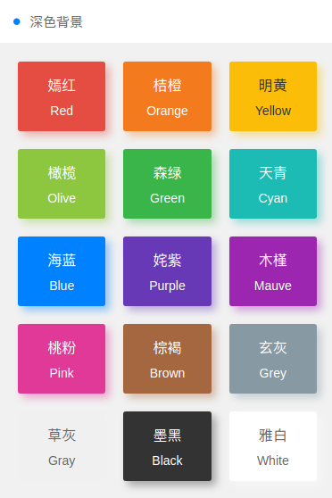
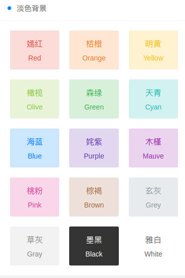

# 背景颜色
> 背景阴影效果class `shadow-blur`  
> 背景圆边角效果class `radius`

## 深色背景

<table>
    <tr>
        <td width="20%">
            <table>
                <thead>
                    <tr>
                        <th>说明</th>
                        <th>className</th>
                        <th>颜色编号</th>
                    </tr>
                </thead>
            <tr>
                <td>嫣红</td>
                <td>bg-red</td>
                <td>#e54d42</td>
            </tr>
            <tr>
                <td>桔橙</td>
                <td>bg-orange</td>
                <td>#f37b1d</td>
            </tr>
            <tr>
                <td>明黄</td>
                <td>bg-yellow</td>
                <td>#fbbd08</td>
            </tr>
            <tr>
                <td>橄榄</td>
                <td>bg-olive</td>
                <td>#8dc63f</td>
            </tr>
            <tr>
                <td>森绿</td>
                <td>bg-green</td>
                <td>#39b54a</td>
            </tr>
            <tr>
                <td>天青</td>
                <td>bg-cyan</td>
                <td>#1cbbb4</td>
            </tr>
            <tr>
                <td>海蓝</td>
                <td>bg-blue</td>
                <td>#0081ff</td>
            </tr>
            <tr>
                <td>姹紫</td>
                <td>bg-purple</td>
                <td>#6739b6</td>
            </tr>
            <tr>
                <td>木槿</td>
                <td>bg-mauve</td>
                <td>#9c26b0</td>
            </tr>
            <tr>
                <td>桃粉</td>
                <td>bg-pink</td>
                <td>#e03997</td>
            </tr>
            <tr>
                <td>棕褐</td>
                <td>bg-brown</td>
                <td>#e03997</td>
            </tr>
            <tr>
                <td>桃粉</td>
                <td>bg-pink</td>
                <td>#a5673f</td>
            </tr>
            <tr>
                <td>玄灰</td>
                <td>bg-grey</td>
                <td>#8799a3</td>
            </tr>
            <tr>
                <td>草灰</td>
                <td>bg-gray</td>
                <td>#aaaaaa</td>
            </tr>
            <tr>
                <td>墨黑</td>
                <td>bg-black</td>
                <td>#333333</td>
            </tr>
            <tr>
                <td>雅白</td>
                <td>bg-white</td>
                <td>#ffffff</td>
            </tr>
            </table>
        </td>
        <td width="30%" height="100%">
            
        </td>
    </tr>
</table>

## 淡色背景
<table>
    <tr>
        <td width="20%">
            <table>
                <thead>
                    <tr>
                        <th>说明</th>
                        <th>className</th>
                        <th>颜色编号</th>
                    </tr>
                </thead>
            <tr>
                <td>嫣红</td>
                <td>bg-red light</td>
                <td>#e54d42</td>
            </tr>
            <tr>
                <td>桔橙</td>
                <td>bg-orange light</td>
                <td>#f37b1d</td>
            </tr>
            <tr>
                <td>明黄</td>
                <td>bg-yellow light</td>
                <td>#fbbd08</td>
            </tr>
            <tr>
                <td>橄榄</td>
                <td>bg-olive light</td>
                <td>#8dc63f</td>
            </tr>
            <tr>
                <td>森绿</td>
                <td>bg-green light</td>
                <td>#39b54a</td>
            </tr>
            <tr>
                <td>天青</td>
                <td>bg-cyan light</td>
                <td>#1cbbb4</td>
            </tr>
            <tr>
                <td>海蓝</td>
                <td>bg-blue light</td>
                <td>#0081ff</td>
            </tr>
            <tr>
                <td>姹紫</td>
                <td>bg-purple light</td>
                <td>#6739b6</td>
            </tr>
            <tr>
                <td>木槿</td>
                <td>bg-mauve light</td>
                <td>#9c26b0</td>
            </tr>
            <tr>
                <td>桃粉</td>
                <td>bg-pink light</td>
                <td>#e03997</td>
            </tr>
            <tr>
                <td>棕褐</td>
                <td>bg-brown light</td>
                <td>#e03997</td>
            </tr>
            <tr>
                <td>桃粉</td>
                <td>bg-pink light</td>
                <td>#a5673f</td>
            </tr>
            <tr>
                <td>玄灰</td>
                <td>bg-grey light</td>
                <td>#8799a3</td>
            </tr>
            <tr>
                <td>草灰</td>
                <td>bg-gray light</td>
                <td>#aaaaaa</td>
            </tr>
            <tr>
                <td>墨黑</td>
                <td>bg-black light</td>
                <td>#333333</td>
            </tr>
            <tr>
                <td>雅白</td>
                <td>bg-white light</td>
                <td>#ffffff</td>
            </tr>
            </table>
        </td>
        <td width="30%" height="100%">
            
        </td>
    </tr>
</table>

## 渐变背景
<table>
    <tr>
        <td width="20%">
            <table>
                <thead>
                    <tr>
                        <th>说明</th>
                        <th>className</th>
                        <th>颜色编号</th>
                    </tr>
                </thead>
            <tr>
                <td>魅红</td>
                <td>bg-gradual-red</td>
                <td>#f43f3b - #ec008c</td>
            </tr>
            <tr>
                <td>桔橙</td>
                <td>bg-orange light</td>
                <td>#f37b1d</td>
            </tr>
            <tr>
                <td>鎏金</td>
                <td>bg-gradual-orange</td>
                <td>#ff9700 - #ed1c24</td>
            </tr>
            <tr>
                <td>翠柳</td>
                <td>bg-gradual-green</td>
                <td>#39b54a - #8dc63f</td>
            </tr>
            <tr>
                <td>靛青</td>
                <td>bg-gradual-blue</td>
                <td>#0081ff - #1cbbb4</td>
            </tr>
            <tr>
                <td>惑紫</td>
                <td>bg-gradual-purple</td>
                <td>#9000ff - #5e00ff</td>
            </tr>
            <tr>
                <td>霞彩</td>
                <td>bg-gradual-pink</td>
                <td>#ec008c - #6739b6</td>
            </tr>
            </table>
        </td>
        <td width="30%" height="100%">
            
        </td>
    </tr>
</table>

## 图片背景


```html
<template>
    <bg-image img="https://albedo-theme.com/wp-content/uploads/2016/08/pexels-photo-26180.jpg">
        <div class="padding-xl text-white">
            <div class="padding-xs text-xl">我和春天有个约会</div>
            <div class="padding-xs">I Have a Date with Spring</div>
        </div>
    </bg-image>
</template>

<script>
import BgImage from "@/components/basics/bgImage";
export default {
  data() {
    return {};
  },

  components: { BgImage },

  computed: {},

  methods: {},

  mounted() {}
};
</script>
```