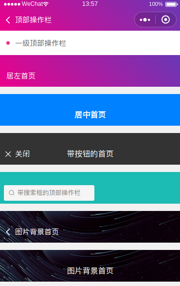
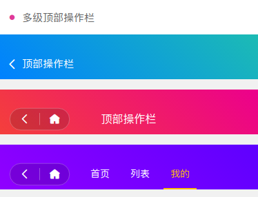

# 顶部操作栏

## 一级导航
>一般用在首页，或者底部多个tab栏时的每个tab栏页面的顶部信息栏目



#### props

| 名称     | 类型    | 默认值                                                  | 描述                                                                  |
| -------- | ------- | ------------------------------------------------------- | --------------------------------------------------------------------- |
| name     | String  | 空                                                      | 标题名                                                                |
| bgColor  | String  | bg-gradual-green   fixed                                | 导航的基础样式className                                               |
| openType | String  | navigateBack                                            | 页面链接方式（navigate，redirect，switchTab，reLaunch，navigateBack） |
| url      | String  | 空                                                      | 页面链接                                                              |
| delta    | Number  | 1                                                       | 回退页数                                                              |
| freebar  | Boolean | false                                                   | 开启自定义内容模式                                                    |
| noneBg   | Boolean | false                                                   | 开启背景为图片模式                                                    |
| bgImg    | String  | https://image.weilanwl.com/color2.0/plugin/cjkz2329.jpg | 背景图片链接（小程序端仅支持网络图片）                                |
| leftMore | Boolean | false                                                   | 左边有更多的按钮                                                      |

#### slot

| 名称     | 描述             |
| -------- | ---------------- |
| freebar  | 自定义内容       |
| leftMore | 左边有更多的按钮 |
| moreCon  | 中间更多内容     |

```html
<template>
  <div>
    <custom name="顶部操作栏" bg-color="bg-gradual-pink fixed"></custom>
    <div class="cu-bar bg-white">
      <div class="action">
        <text class="icon-title text-pink"></text>
        <text>一级顶部操作栏</text>
      </div>
    </div>

    <custom
      name="居左首页"
      bg-color="bg-gradual-pink"
      open-type="switchTab"
      url="/pages/basics/index"
    ></custom>

    <custom bg-color="bg-blue margin-top" freebar>
      <div slot="freebar">
        <div class="content text-bold" :style="conTop">居中首页</div>
      </div>
    </custom>

    <custom bg-color="bg-black margin-top" freebar>
      <div slot="freebar">
        <div class="action">
          <text class="icon-close"></text>关闭
        </div>
        <div class="content" :style="conTop">带按钮的首页</div>
      </div>
    </custom>

    <custom bg-color="bg-cyan margin-top search" freebar>
      <div slot="freebar">
        <div class="search-form radius">
          <text class="icon-search"></text>
          <input type="text" placeholder="带搜索框的顶部操作栏" confirm-type="search">
        </div>
      </div>
    </custom>

    <custom
      name="图片背景首页"
      bg-color="margin-top"
      bg-img="https://image.weilanwl.com/color2.0/plugin/cjkz2329.jpg"
      noneBg
    ></custom>

    <custom
      bg-color="margin-top"
      bg-img="https://image.weilanwl.com/color2.0/plugin/cjkz2329.jpg"
      noneBg
      freebar
    >
      <div slot="freebar">
        <div class="content" :style="conTop">图片背景首页</div>
      </div>
    </custom>
  </div>
</template>

<script>
import Custom from "@/components/custom";
import { obj2style } from "@/utils/index";
export default {
  data() {
    return {};
  },

  components: { Custom },

  computed: {
    conTop() {
      let style = {};
      style["top"] = uni.getStorageSync("StatusBar") + "px";
      return obj2style(style);
    }
  },

  methods: {},

  mounted() {}
};
</script>
<style lang='scss'>
</style>

```

#### 注意

* obj2style 方法是从一个已经封装好的公用方法，下面是该源码，可自行根据需求进行使用

```html
/**
 * 为样式动态赋值
 * @param {*} style
 */
export function obj2style(style) {
  let str = [];
  Object.keys(style).forEach(key => {
    str.push(`${key}:${style[key]};`);
  });
  return str.join(';');
}
```

* 关于头部状态栏高度的计算(见App.vue)

```html
const systemInfo = uni.getSystemInfoSync();
let CustomBar =
    systemInfo.platform === "android"
    ? systemInfo.statusBarHeight + 50
    : systemInfo.statusBarHeight + 45;
let StatusBar = systemInfo.statusBarHeight;
uni.setStorageSync("CustomBar", CustomBar);
uni.setStorageSync("StatusBar", StatusBar);
```

## 多级导航
>一般用于二级以上的页面，能够直接跳转到想要跳转的页面



```html
<template>
<custom name="顶部操作栏" bg-color="bg-gradual-blue"></custom>

<custom bg-color="bg-gradual-red margin-tb" leftMore>
    <text slot="leftMore">
    <text class="icon-homefill"></text>
    </text>
    <div slot="moreCon">
    <div class="content" :style="conTop">顶部操作栏</div>
    </div>
</custom>

<custom name="顶部操作栏" bg-color="bg-gradual-purple margin-tb" leftMore>
    <text slot="leftMore">
    <text class="icon-homefill"></text>
    </text>
    <div slot="moreCon">
    <scroll-view scroll-x class="nav text-center" :style="CustomBar">
        <div
        class="cu-item"
        :class="index==TabCur?'text-yellow cur':''"
        v-for="(item,index) in tabNav"
        :key="index"
        @click="tabSelect(index)"
        >{{item}}</div>
    </scroll-view>
    </div>
</custom>
</template>

<script>
import Custom from "@/components/custom";
import { obj2style } from "@/utils/index";
export default {
  data() {
    return {
      TabCur: 0,
      tabNav: ["首页", "列表", "我的"]
    };
  },

  components: { Custom },

  computed: {
    conTop() {
      let style = {};
      style["top"] = uni.getStorageSync("StatusBar") + "px";
      return obj2style(style);
    }
  },

  methods: {
    tabSelect(index) {
      this.TabCur = index;
    }
  },

  mounted() {}
};
</script>
```