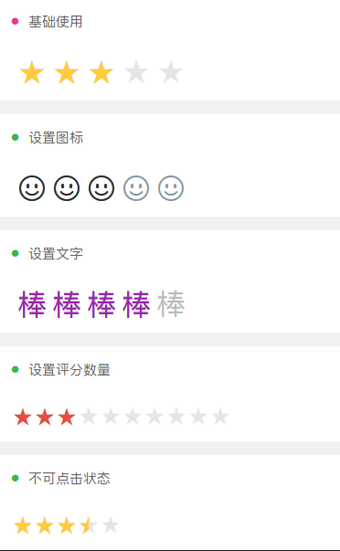

# 星级评价



#### props

| 名称     | 类型    | 默认值                                                  | 描述                                                                  |
| -------- | ------- | ----------------- | -------------------- |
| color     | String  | #e5e5e5       | 基础颜色          
| activeColor     | String  | #ffca3e       | 选中颜色          
| icon     | String  | 空       | icon-font图标名（优先级高于star）    
| star     | String  | ★       | 文字方式展示（有icon值的时候该值不生效）     
| size     |  [Number, String]  | 24       | 大小     
| value     |  [Number, String]  | 0       | 当前评分     
| max     |  [Number, String]  | 5       | 最大评分     
| margin     |  [Number, String]  | 0       | 间距     
| disabled     |  [Boolean, String]  | false       | 是否可点击     

#### event

| 名称     | 参数               | 描述         
| -------- | -------------------- |------------ |
| change     | value       | 点击的评分结果


```html
<template>
  <div>
    <custom name="星级评价" bg-color="bg-gradual-pink fixed"></custom>

    <div>
      <div class="cu-bar bg-white margin-top">
        <div class="action">
          <text class="icon-title text-pink"></text>
          <text>基础使用</text>
        </div>
      </div>
      <div class="padding bg-white">
        <rater :size="32" :value="1" :margin="6" @change="onChange"></rater>
      </div>

      <div class="cu-bar bg-white margin-top">
        <div class="action">
          <text class="icon-title text-green"></text>
          <text>设置图标</text>
        </div>
      </div>
      <div class="padding bg-white">
        <rater icon="icon-emoji" :value="1" :size="32" :margin="6" color="#8799a3" active-color="#333333"></rater>
      </div>

      <div class="cu-bar bg-white margin-top">
        <div class="action">
          <text class="icon-title text-green"></text>
          <text>设置文字</text>
        </div>
      </div>
      <div class="padding bg-white">
        <rater star="棒" :value="3" :size="32" :margin="6" color="#bbb" active-color="#9c26b0"></rater>
      </div>

      <div class="cu-bar bg-white margin-top">
        <div class="action">
          <text class="icon-title text-green"></text>
          <text>设置评分数量</text>
        </div>
      </div>
      <div class="padding bg-white">
        <rater :max="10" :value="5" active-color="#e54d42"></rater>
      </div>

      <div class="cu-bar bg-white margin-top">
        <div class="action">
          <text class="icon-title text-green"></text>
          <text>不可点击状态</text>
        </div>
      </div>
      <div class="padding bg-white">
        <rater :disabled="true" :value="3.5"></rater>
      </div>
    </div>
  </div>
</template>

<script>
import Custom from "@/components/custom";
import Rater from "@/components/rater";
export default {
  data() {
    return {};
  },

  components: { Custom, Rater },

  computed: {},

  methods: {
    onChange(e) {
      console.log("rate发生改变:" + JSON.stringify(e));
    }
  },

  mounted() {}
};
</script>
<style lang='scss'>
</style>

```