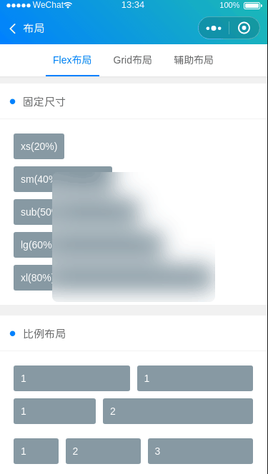

# 导航栏




#### props

| 名称       | 类型    | 默认值                               | 描述             |
| ---------- | ------- | ------------------------------------ | ---------------- |
| tabList       | Array  | 空                                   | tab数组，数据基本格式为[{name:'名称',icon:'图标'}] |
| tabCur       | Number  | 0                                   | 被选中的tab位置 |
| tabClass       | String  | 空                                   | tab的基础样式 |
| tabStyle       | String  | 空                                   | tab的基础样式 |
| textFlex       | String  | false                                   | 是否平分 |
| selectClass       | String  | text-green                                   | tab被选中项的基础样式 |


#### event

| 名称     | 描述             |
| -------- | ---------------- |
| tabCur  | 被选中位置（双向）       |
| change  | 点击事件       |

```html
<template>
  <div>
    <custom name="导航栏" bg-color="bg-gradual-pink fixed"></custom>

    <swiper
      :current="TabCur"
      class="swiper row"
      duration="300"
      @change="swiperChange"
    >
      <swiper-item v-for="(item,index) in tabList" :key="index">
        <div class="bg-grey padding margin text-center">Tab{{index}}</div>
      </swiper-item>
    </swiper>

    <div>
      <div class="cu-bar bg-white solid-bottom">
        <div class="action">
          <text class="icon-titles text-orange"></text>默认
        </div>
      </div>
      <wuc-tab
        :tab-list="tabList"
        :tabCur.sync="TabCur"
        tab-class="bg-white text-black"
      ></wuc-tab>
    </div>

    <div>
      <div class="cu-bar bg-white margin-top solid-bottom">
        <div class="action">
          <text class="icon-title text-orange"></text>居中选中放大
        </div>
      </div>
      <wuc-tab
        :tab-list="tabList2"
        :tabCur.sync="TabCur"
        tab-class="text-center text-black bg-white"
        select-class="text-blue text-xl"
      ></wuc-tab>
    </div>

    <div>
      <div class="cu-bar bg-white margin-top solid-bottom">
        <div class="action">
          <text class="icon-title text-orange"></text>平分
        </div>
      </div>
      <wuc-tab
        :tab-list="tabList2"
        textFlex
        :tabCur.sync="TabCur"
        tab-class="text-center text-black bg-white"
        select-class="text-orange"
      ></wuc-tab>
    </div>

    <div>
      <div class="cu-bar bg-white margin-top solid-bottom">
        <div class="action">
          <text class="icon-title text-orange"></text>背景
        </div>
      </div>
      <wuc-tab
        :tab-list="tabList2"
        :tabCur.sync="TabCur"
        tab-class="text-center text-white bg-red"
        select-class="text-white"
      ></wuc-tab>
    </div>

    <div>
      <div class="cu-bar bg-white margin-top solid-bottom">
        <div class="action">
          <text class="icon-title text-orange"></text>图标
        </div>
      </div>
      <wuc-tab
        :tab-list="tabList3"
        :tabCur.sync="TabCur"
        tab-class="text-center text-white bg-green"
        select-class="text-white"
      />
    </div>
  </div>
</template>

<script>
import Custom from "@/components/custom";
import WucTab from "@/components/tab";
export default {
  data() {
    return {
      tabList: [
        { name: "tab0" },
        { name: "tab1" },
        { name: "tab2" },
        { name: "tab3" },
        { name: "tab4" },
        { name: "tab5" },
        { name: "tab6" },
        { name: "tab7" }
      ],
      tabList2: [
        { name: "tab0" },
        { name: "tab1" },
        { name: "tab2" },
        { name: "tab3" }
      ],
      tabList3: [
        { name: "数码", icon: "icon-camerafill" },
        { name: "奖杯", icon: "icon-upstagefill" },
        { name: "衣服", icon: "icon-clothesfill" }
      ],
      TabCur: 0
    };
  },

  components: { Custom, WucTab },

  computed: {},

  methods: {
    swiperChange(e) {
      let { current } = e.target;
      this.TabCur = current;
    }
  },

  mounted() {}
};
</script>
<style lang='scss'>
.swiper {
  position: relative;
  display: block;
  width: 100%;
  height: 148rpx;
}
</style>

```