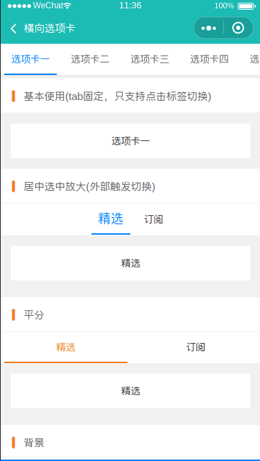

# 横向选项卡



#### props

| 名称       | 类型    | 默认值                               | 描述             |
| ---------- | ------- | ------------------------------------ | ---------------- |
| tabList       | Array  | 空                                   | tab数组，数据基本格式为[{name:'名称',icon:'图标'}] |
| tabCur       | Number  | 0                                   | 被选中的tab位置 |
| tabClass       | String  | 空                                   | tab的基础样式 |
| tabStyle       | String  | 空                                   | tab的基础样式 |
| selectClass       | String  | text-green                   | tab被选中项的基础样式 |
| textFlex       | String  | false                                   | 是否平分 |


#### event

| 名称     | 描述             |
| -------- | ---------------- |
| tabCur  | 被选中位置（双向）       |
| change  | 点击事件       |

```html
<template>
  <div>
    <custom name="横向选项卡" bg-color="bg-cyan fixed"></custom>

    <div>
      <wuc-tab
        :tab-list="tabList"
        :tabCur.sync="TabCur"
        :tab-style="CustomBar"
        tab-class="text-center bg-white nav fixed"
        select-class="text-blue"
        @change="tabChange"
      ></wuc-tab>
      <div class="cu-bar bg-white solid-bottom" style="margin-top:100upx">
        <div class="action">
          <text class="icon-titles text-orange"></text>基本使用(tab固定，只支持点击标签切换)
        </div>
      </div>
      <div
        class="bg-white padding margin text-center text-black"
      >{{tabList[TabCur].name}}</div>
    </div>

    <div>
      <div class="cu-bar bg-white margin-top solid-bottom">
        <div class="action">
          <text class="icon-titles text-orange"></text>居中选中放大(外部触发切换)
        </div>
      </div>
      <wuc-tab
        :tab-list="tabList2"
        :tabCur.sync="TabCur2"
        tab-class="text-center text-black bg-white"
        select-class="text-blue text-xl"
      ></wuc-tab>
      <swiper
        :current="TabCur2"
        class="swiper row"
        duration="300"
        :circular="true"
        indicator-color="rgba(255,255,255,0)"
        indicator-active-color="rgba(255,255,255,0)"
        @change="swiperChange2"
      >
        <swiper-item v-for="(item,index) in tabList2" :key="index">
          <div
            class="bg-white padding margin text-center text-black"
          >{{item.name}}</div>
        </swiper-item>
      </swiper>
    </div>

    <div>
      <div class="cu-bar bg-white margin-top solid-bottom">
        <div class="action">
          <text class="icon-titles text-orange"></text>平分
        </div>
      </div>
      <wuc-tab
        :tab-list="tabList3"
        textFlex
        :tabCur.sync="TabCur3"
        tab-class="text-center text-black bg-white"
        select-class="text-orange"
      ></wuc-tab>
      <swiper
        :current="TabCur3"
        class="swiper row"
        duration="300"
        :circular="true"
        indicator-color="rgba(255,255,255,0)"
        indicator-active-color="rgba(255,255,255,0)"
        @change="swiperChange3"
      >
        <swiper-item v-for="(item,index) in tabList3" :key="index">
          <div
            class="bg-white padding margin text-center text-black"
          >{{item.name}}</div>
        </swiper-item>
      </swiper>
    </div>

    <div>
      <div class="cu-bar bg-white margin-top solid-bottom">
        <div class="action">
          <text class="icon-titles text-orange"></text>背景
        </div>
      </div>
      <wuc-tab
        :tab-list="tabList4"
        :tabCur.sync="TabCur4"
        tab-class="text-center text-white bg-blue"
        select-class="text-white"
      ></wuc-tab>
      <swiper
        :current="TabCur4"
        class="swiper row"
        duration="300"
        :circular="true"
        indicator-color="rgba(255,255,255,0)"
        indicator-active-color="rgba(255,255,255,0)"
        @change="swiperChange4"
      >
        <swiper-item v-for="(item,index) in tabList4" :key="index">
          <div
            class="bg-white padding margin text-center text-black"
          >{{item.name}}</div>
        </swiper-item>
      </swiper>
    </div>

    <div>
      <div class="cu-bar bg-white margin-top solid-bottom">
        <div class="action">
          <text class="icon-titles text-orange"></text>图标
        </div>
      </div>
      <wuc-tab
        :tab-list="tabList5"
        :tabCur.sync="TabCur5"
        tab-class="text-center text-black bg-white"
        select-class="text-blue"
      />
      <swiper
        :current="TabCur5"
        class="swiper row"
        duration="300"
        :circular="true"
        indicator-color="rgba(255,255,255,0)"
        indicator-active-color="rgba(255,255,255,0)"
        @change="swiperChange5"
      >
        <swiper-item v-for="(item,index) in tabList5" :key="index">
          <div
            class="bg-white padding margin text-center text-black"
          >{{item.name}}</div>
        </swiper-item>
      </swiper>
    </div>
  </div>
</template>

<script>
import Custom from "@/components/custom";
import WucTab from "@/components/tab";
import { obj2style } from "@/utils/index";
export default {
  data() {
    return {
      tabList: [
        { name: "选项卡一" },
        { name: "选项卡二" },
        { name: "选项卡三" },
        { name: "选项卡四" },
        { name: "选项卡五" },
        { name: "选项卡六" },
        { name: "选项卡七" },
        { name: "选项卡八" }
      ],
      tabList2: [{ name: "精选" }, { name: "订阅" }],
      tabList3: [{ name: "精选" }, { name: "订阅" }],
      tabList4: [
        { name: "推荐" },
        { name: "热点" },
        { name: "视频" },
        { name: "问答" },
        { name: "社会" },
        { name: "娱乐" },
        { name: "科技" },
        { name: "汽车" }
      ],
      tabList5: [
        { name: "短信", icon: "icon-comment" },
        { name: "电话", icon: "icon-dianhua" },
        { name: "wifi", icon: "icon-wifi" }
      ],
      TabCur: 0,
      TabCur2: 0,
      TabCur3: 0,
      TabCur4: 0,
      TabCur5: 0
    };
  },

  components: { Custom, WucTab },

  computed: {
    CustomBar() {
      let style = {};
      style["top"] = uni.getStorageSync("CustomBar") + "px";
      return obj2style(style);
    }
  },

  methods: {
    tabChange(index) {
      this.TabCur = index;
    },
    swiperChange2(e) {
      let { current } = e.target;
      this.TabCur2 = current;
    },
    swiperChange3(e) {
      let { current } = e.target;
      this.TabCur3 = current;
    },
    swiperChange4(e) {
      let { current } = e.target;
      this.TabCur4 = current;
    },
    swiperChange5(e) {
      this.TabCur5 = e.target.current;
    }
  },

  mounted() {}
};
</script>
<style lang='scss'>
.swiper {
  position: relative;
  display: block;
  width: 100%;
  height: 148upx;
}
</style>


```